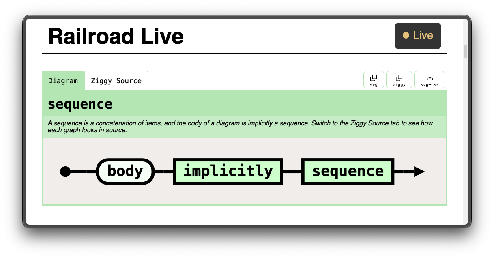

# railroad
Railroad diagrams generator.


## Live Preview
Run `railroad live foo.ziggy` to start a live reloading web server that will
update on file save. If the input file does not exist, it will be automatically
created and filled with example definitions.

The live preview allows you also copy SVG code (for embedding) and to download SVG images.
See the help menu for more options.



## CLI
```
$ railroad
Usage: railroad [COMMAND] [OPTIONS]

Render railroad diagrams defined in a Ziggy Document.

Run `railroad install-schema` to see the Ziggy Schema
for railroad definitions. Go to https://ziggy-lang.io
for more information about Ziggy.

Commands:
  live            Start the live-reloading web server
  build           Output diagrams as HTML or SVG files
  install-schema  Install the railroad Ziggy Schema
  show-css        Display the default CSS stylesheet
  help            Show this menu and exit

General options:
  --help, -h      Print command specific usage and extra options
```

## Syntax
An sample input Ziggy Document looks like this:
```ziggy
{
    "diagram": .{
        .body = [
            .sequence_stack([
                .terminal("rail"),
                .external("road"),
            ]),
            .terminal("diagrams"),
        ],
    },
    
    "another": .{
        .body = [
            .choice_middle([
                .terminal("a"),
                .external("b"),
                .terminal("c"),
            ]),
        ],
    },
}
```

## Editor support
Railroad uses Ziggy as its input file format. This repository comes with a Ziggy Schema
definition that will be picked up by the Ziggy Language Server to give you diagnostics,
auto complete and goto definition support in your editor.

Go to https://ziggy-lang.io to learn more about Ziggy and to learn how to setup your editor.

For convenience: 
- [Flow Control](https://flow-control.dev) comes with Ziggy support out of the box (you will still need to download the Ziggy CLI tool).
- VSCode has a Ziggy extension in the marketplace (also on OpenVSX), and does not require you to install anything else.

## Credits
This is a Zig port of the excellent
[tabatkins/railroad-diagrams](https://github.com/tabatkins/railroad-diagrams/tree/gh-pages)
generator (originally written in JS and Python). I have recreated all
constructs, fixed some minor bugs and introduced some relatively small
changes from the original:

- introduced item and path labels
- separated `non_terminal` into `reference` and `external`
- added some aliases and made other adjustments to improve the ergonomics
  for writing diagram definitions in Ziggy

